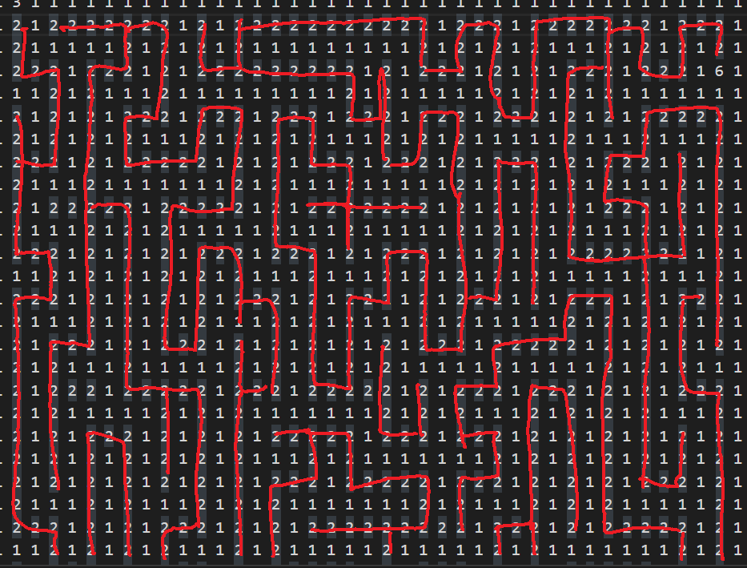
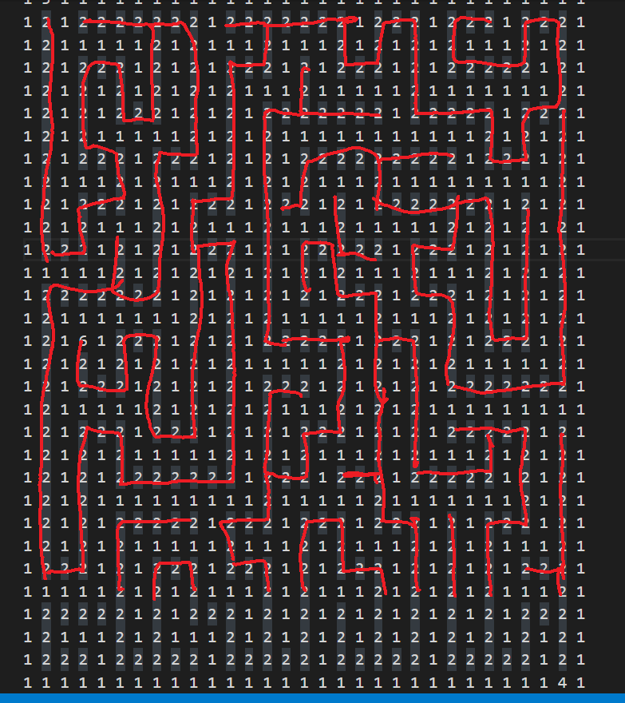
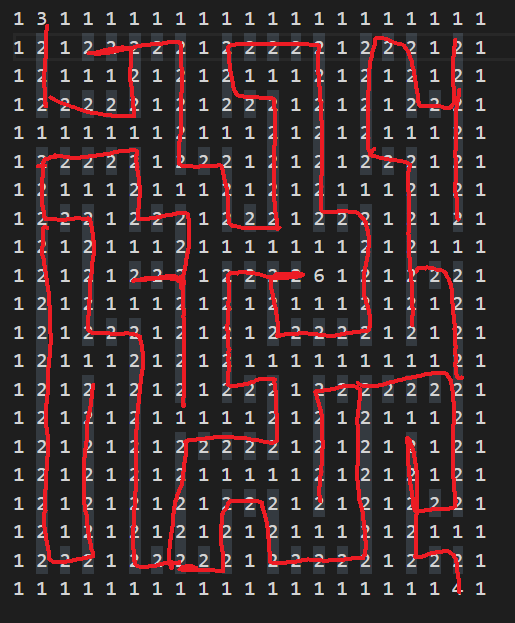

# 인공지능 과제 보고서
#### 2012003909 김승현

과제목표
------
이번 과제의 목표는 수업에서 배운 여러가지 경로를 찾는 알고리즘을 이용하여 각 층마다 최선의 알고리즘과 그를 구현하는 것입니다.
수업에서 배운 경로를 찾는 알고리즘은 다음과 같습니다
- Depth First Search (DFS)
- Breath First Search (BFS)
- Uniform Cost Search
- Iterative Deepening Search (IDS)
- Greedy Best First Search
- A\* Search
- Local Search

들이 있습니다. 저는 여기서 미로같은 형식에서 구현하기 까다로운 **Local Search**와, 가중치가 1인 곳에서는 BFS와 똑같이 작동하는 **Uniform Cost Search** 제외하고 구현하고 테스트 해보았습니다.

Breath First Search,  Iterative Deepening Search, A\* Search는 **Optimality**가 확실하게 보장되는 반면,

Depth First Search (DFS) 와 Greedy Best First Search는 **Optimality**가 확실하게 보장되지 않습니다.

저는 따라서 BFS, IDS, A\* Search의 결과를 이용해 최단경로의 길이와 그 여부를 알아내고, 위의 5가지 알고리즘의 시간을 비교하기로 하였습니다.

소스 코드 설명
------
소스 코드에는 Maze 클래스와 필요한 메서드들이 선언 되어 있습니다.

코드의 재사용성과 추후의 수정을 고려하여 모든 층의 로직은 execute 함수로 동작하도록 설계하였습니다.

execute 함수는 첫번째 인자에 맞춰 input과 을 읽어 Maze 인스턴스를 만든 후,두번째 인자의 함수를 실행시켜 결과를 얻어 output 파일에 출력하는 함수 입니다.
 Maze 클래스에는 A\*, BFS, IDS, Greedy Best First Search, DFS 알고리즘이 구현되어 있습니다.

다음은 Maze 클래스 변수별 설명입니다.

| Variable | type  | Description        |
| -------- | ----- | ------------------ |
| start    | tuple | 미로의 시작지점 위치를 나타냅니다 |
| key      | tuple | 열쇠가 있는 지점을 나타냅니다   |
| map      | tuple | 미로 배열입니다.          |
| height   | int   | 미로의 높이를 나타냅니다      |
| width    | int   | 미로의 너비를 나타냅니다      |
다음은 Maze 클래스 메서드별 설명입니다.
| Method          | Description                                                              |
| --------------- | ------------------------------------------------------------------------ |
| copy            | 미로 인스턴스를 복제하여 반환합니다                                                      |
| checkPos        | 지정좌표 y,x 가 막힌 길인지 체크합니다                                                  |
| move            | 지정한 좌표 y,x에서 지정 방향으로 움직일 수 있는지 여부를 체크합니다                                 |
| createPathTrack | 경로를 역추적하기 위한 배열을 생성합니다                                                   |
| applyPath       | 역추적하기 위해 기록한 배열을 이용해 경로를 추적합니다                                           |
| dfs_sub         | step만큼 DFS를 사용해 경로를 탐색합니다                                                |
| ids_sub         | IDS를 이용해 경로를 탐색합니다                                                       |
| ids             | ids_sub를 이용해 키를 찾고 도착지점까지 경로를 탐색합니다                                      |
| pr_bfs_sub       | a\* 알고리즘으로 경로를 탐색합니다                                                     |
| astar           | a\* 알고리즘으로 키를 찾고 도착지점까지 경로를 탐색합니다 pr_bfs_sub를 이용                          |
| bfs             | BFS 알고리즘으로 키를 찾고 도착지점까지 경로를 탐색합니다 pr_bfs_sub의 priority 함수를 0으로 지정해 사용합니다 |
| print           | 미로를 출력합니다                                                                |
| gbs             | Greedy Best First Search 알고리즘으로 키를 찾고 도착점까지 경로를 탐색합니다. pr_bfs_sub를 사용했습니다 |
| dfs             | DFS 알고리즘으로 키를 찾고 도착지점까지 경로를 탐색합니다. dfs_sub에서 step을 엄청 크게 넣어 이용합니다        |
1층
-----
- 사용한 알고리즘 : **Greedy Best First Search**
- 탐색한 노드 개수 (time) : **5840**
- 탐색 경로의 길이 (length) : **3850**
- 최단 경로의 길이 : **3850**
- 최단 경로 여부 : **True**

모든 층은 execute 함수를 이용합니다. execute함수에서는 경로 찾는 알고리즘을 수행하는 함수를 따로 정의하여 인자로 전달합니다

Maze 클래스의 gbs 함수는 Greedy Best First Search 를 구현한 함수입니다.
함수의 내부는 다음과 같습니다

Maze 클래스에서 선언한 pr_bfs_sub 함수를 이용하여 구현하였습니다.
pr_bfs_sub는 priority queue를 사용한 BFS함수로써 Greedy Best First Search는 priority를 heuristic 함수로만 정의하여 동작하도록 했습니다.

1층은 101*101으로써 상대적으로 갈 경로가 많은 미로입니다. 
따라서 저는 아마도 Greedy 와 DFS는 시간은 덜 들을 지라도 최적경로를 찾지 못할 것이고, 
Optimality를 보장하는 BFS, IDS, A\* 중에서도 특히 A\* 알고리즘이 제일 빠를 것이라 예상했습니다.

하지만 측정값은 제 예상과는 다르게 나왔습니다.

측정 값에서 알 수 있듯이,  IDS,DFS는 Recursion 오류가 떠버렸고, A\* 알고리즘이 확실히 BFS보다 빠르다는 것을 알 수 있었지만, 예상과는 다르게 Greedy Best First Search가 최단 경로를 찾고 탐색 경로 역시 다른 알고리즘에 비해 많이 빨랐습니다. 저는 그래서 **Greedy Best First Search**를 사용해 1층 미로를 통과했습니다.

2층
-----
- 사용한 알고리즘 : **Greedy Best First Search**
- 탐색한 노드 개수 (time) : **1013**
- 탐색 경로의 길이 (length) : **758**
- 최단 경로의 길이 : **758**
- 최단 경로 여부 : **True**

2층 역시 1층과 마찬가지로 Greedy Best First Search를 이용 했기 때문에 입력/출력 파일을 제외하고 모든 로직은 같습니다.

2층은 51x51으로써 1층 보다 작은 미로이지만 여전히 A\* 알고리즘이 Optimality를 보장하는 다른 두 알고리즘에 비해 빠를 것이라 생각했습니다. 
 
또한 Greedy Best First Search와 DFS는 빠를지는 몰라도 최단 경로를 찾지 못할 확률이 높다고 생각했습니다.

하지만 측정한 결과, A\* 알고리즘은 여전히 BFS, IDS비해 빠르게 나왔지만, 제 예상과는 다르게 Greedy Best First Search가 최단 경로가 나옴과 동시에 탐색한 노드 역시 DFS를 제외한 알고리즘들과 비교하여 빨랐습니다.

DFS가 최소의 탐색 경로 길이(length)를 가지고 있지만, Optimal 하지 않아서 저는 2층을 Greedy Best First Search로 결정 하였습니다.

3층
-----
- 사용한 알고리즘 : **Greedy Best First Search**
- 탐색한 노드 개수 (time) : **662**
- 탐색 경로의 길이 (length) : **554**
- 최단 경로의 길이 : **554**
- 최단 경로 여부 : **True**

3층 역시 1층과 마찬가지로 Greedy Best First Search를 이용 했기 때문에 입력/출력 파일을 제외하고 모든 로직은 같습니다.

3층은 41x41 으로써 미로의 열린 길은 다음과 같습니다

길을 살펴보면 다른 경로로 가는 갈림길이 많은 것을 알 수 있습니다. 이런 경우 IDS, BFS 탐색 했을 때는 더 많은 시간이 소요될 것이라 생각했습니다. 

또한 Greedy Best First Search나 DFS는 Optimal하지 않은 결과를 낼 확률이 높을 것이라 예상했습니다.

측정한 결과 역시 IDS나 BFS가 A\*에 비하여 상대적으로 느리다는 것을 알 수 있습니다

하지만 제 예상과는 다르게 Greedy Best First Search는 최단 경로를 찾았고 다른 알고리즘들에 비하여 빠른 속도를 보여주었습니다.
DFS는 탐색한 노드는 제일 작지만 최단 경로를 찾아내지는 못했습니다.
따라서 저는 3층 역시 Greedy Best First Search로 결정하였습니다.

4층
-----
- 사용한 알고리즘 : **Greedy Best First Search**
- 탐색한 노드 개수 (time) : **455**
- 최단 경로의 길이 (length) : **334**
- 최단 경로 여부 : **True**

4층 역시 1층과 마찬가지로 Greedy Best First Search를 이용 했기 때문에 입력/출력 파일을 제외하고 모든 로직은 같습니다.

4층은 31x31 으로써 미로의 열린 길은 다음과 같습니다

길을 살펴보면 다른 경로로 가는 갈림길이 그렇게 많지 않은 것을 알 수 있습니다. 이런 경우 BFS로 탐색했을 때 A\*와 별 차이가 없거나 더 빠를 수 있다고 생각했습니다.

그리고 Greedy Best First Search나 DFS가 빠르고 최단 경로를 찾을 확률이 높을 것이라고 예상했습니다.

측정한 결과 제 예상과는 비슷하게 Greedy < DFS < A\* < BFS < IDS 순서로 노드를 탐색하였고, A\*, BFS, Greedy Best First Search, IDS 는 최단 경로로 나왔지만, DFS는 최단 경로보다는 조금 긴 경로로 결과를 얻었습니다.
저는 따라서 최단경로이면서 탐색한 노드가 적은 Greedy Best First Search를 4층의 알고리즘으로 결정하였습니다.

5층
-----
- 사용한 알고리즘 : **Greedy Best First Search**
- 탐색한 노드 개수 (time) : **121**
- 최단 경로의 길이 (length) : **106**
- 최단 경로 여부 : **True**

5층 역시 1층과 마찬가지로 Greedy Best First Search를 이용 했기 때문에 입력/출력 파일을 제외하고 모든 로직은 같습니다.

5층은 21x21 으로써 미로의 열린 길은 다음과 같습니다

길을 살펴보면 미로의 크기도 적고 다른 경로로 가는 갈림길이 그렇게 많지 않다고 생각하여 BFS로 탐색했을 때 A\*와 별 차이가 없거나 더 빠를 수 있다고 생각했습니다.

측정한 결과 제 예상과는 비슷하게 Greedy < A\* < DFS < BFS < IDS 순서로 노드를 탐색하였고, A\*, BFS, Greedy Best First Search, IDS 는 최단 경로로 나왔지만, DFS는 최단 경로보다는 조금 긴 경로로 결과를 얻었습니다.
저는 따라서 최단경로이면서 탐색한 노드가 적은 Greedy Best First Search를 5층의 알고리즘으로 결정하였습니다.

결론
-----

우연이었는지는 몰라도 5층 모두 Greedy Best First Search가 최단 경로를 찾아내고 상상외의 성능을 보여주었습니다. DFS 역시 좋은 성능을 보어주였지만 최단 경로를 찾지는 못했습니다.
하지만 A\* Search 역시 좋은 성능을 보여주며 확실하게 최단 경로를 찾아준다는 점에서 뛰어난 알고리즘이라고 생각했습니다. 과제의 미로들에는 5층 모두 Greedy Best First Search를 적용 시켰지만, 갈림길이 많고, 미로의 크기가 큰 경우에는 좋고 안전한 A\* Search를 이용하는 것이 더 효율적일 것이라고 생각이 들었습니다.